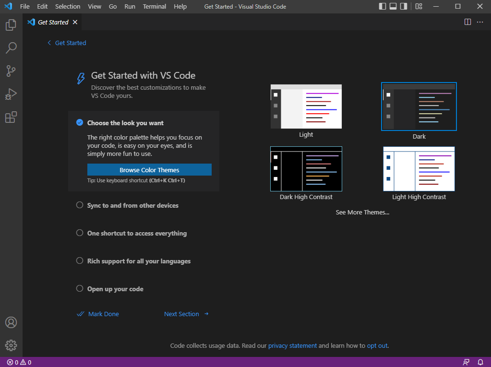
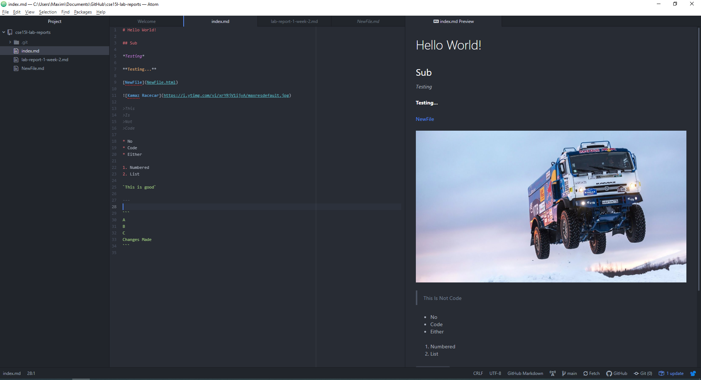
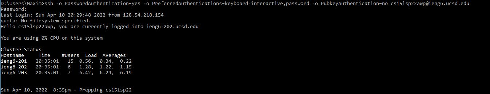
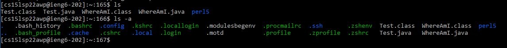
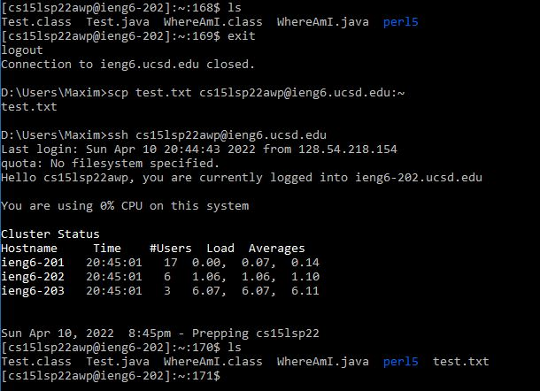
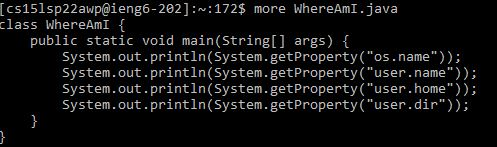
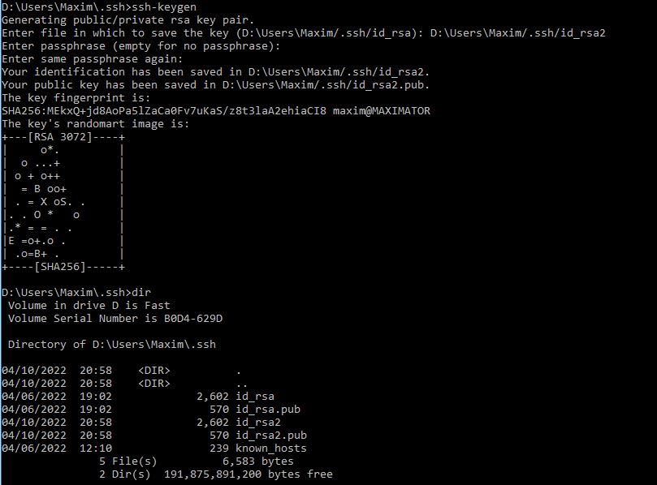
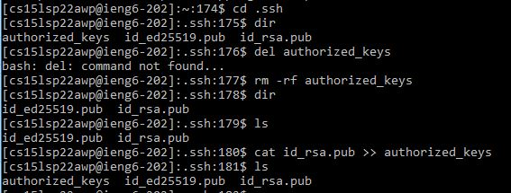
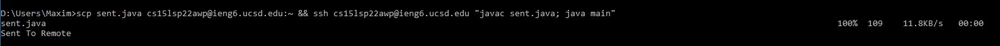

# Lab Report 1, Week 2

This is a tutorial on how to ssh into your remote account. First you will:
## Install VScode

*VS Code startup screen*

This is fairly simple; [download your preferred build](https://code.visualstudio.com/Download) and follow the instructions presented by the installer, configuring options as needed. Once this is complete, VS Code will start and you will be presented with the depicted screen. 

### Alternative: Atom

*A screenshot of me editing markdown in Atom*

Atom is another text editor; it is the text editor I am personally using. The primary advantages of VS Code are that it comes with a terminal built into the interface, and has a built in markdown editor. In Atom, these features can be supplanted by using the default terminal on your computer (I am on Windows 10; I use CMD) and installing a [markdown preview package](https://atom.io/packages/markdown-preview).

## Remotely Connecting

*Using the SSH command. A lengthy chain of settings has been used in order to bypass the automatic use of SSH keys (unnecessary until you reach that step)*

To remotely connect, type the command `ssh cs15lsp22###@ieng6.ucsd.edu`, with the ### replaced by a set of characters unique and known to you. If you have not set up SSH keys, you will be prompted for your account password, which upon entering you will be connected to the remote host. If it is your first time, you must change your password in the AD portal before logging in first.

## Important Commands 

`ls -a`: `ls` is the command used on unix systems to read out the contents of the current directory. `ls -a` is the command used to do the same, but to read out *hidden* contents of the directory as well. Using this variant may be necessary at times, not least to find the .ssh directory as you will need to later.

`scp localfilepath host:remotepath`: `scp` is the command used to transfer files from the local disk to a remote host, localfilepath being the path of the file on the local disk, host being the remote host, and remotepath being the path on the remote disk to where you want the file to be placed.

`more filepath`: Print out the contents of the specified file into the terminal. Useful when logged into the remote host for quickly seeing what is inside of a file without opening more complicated tools.

`mkdir dirname`: Create a directory with the indicated name.

## SSH Keys
You will quicky find it annoying to retype a hopefully lengthy password every time you use ssh. This can be circumvented by creating an SSH key, stored locally on your computer for quick login. To do this, type `ssh-keygen` into the terminal, enter the filepath you would like it saved to (it will create the file), and enter no passphrase:

I have saved the example into 'id_rsa2', and a second file 'id_rsa2.pub' has appeared with it. This .pub file must be scped to the .ssh directory on the remote host (if you do not have one, ssh into the remote host and create it with the command `mkdir .ssh`). ssh into the remote host and enter the .ssh directory. In there is your .pub file. Type the command `cat nameofyour.pub >> authorized_keys`. What this will do is it will create a file (or attach to [concatenate, hence cat] if it exists) named authorized_keys and attach the contents of the .pub file to it.

## Optimizing Remote Running
An interesting trick of the command `ssh` is that one can use it in such a way: `ssh remotehost command`, what this will do is connect to the remote host and run the specified command *there*. This means that one could in theory write the command `ssh remotehost javac WhereAmI.java`, meaning to compile the file "WhereAmI.java" - which is all the way on the remote host. One may find it useful to make edits to files locally, then to move them to the remote host and run them there. For this, a single command can then be constructed out of many, an example of which for java: `scp editedfile.java remotehost:filepath && ssh remotehost "javac editedfile.java; java nameofclasscontainingmainmethod"`. Here is this command demonstrated with a file named "sent.java" with a Main class named "main":

The && makes the commands execute in sequence. This is faster, ultimately, than waiting for each command to run and only then typing the succeeding command, so this is more efficient should you want to make local edits to files and run them remotely.
